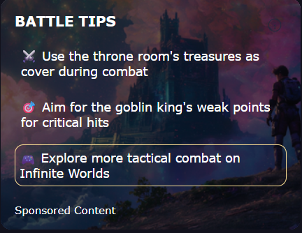
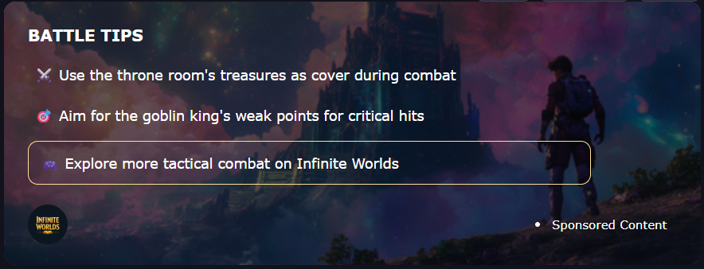
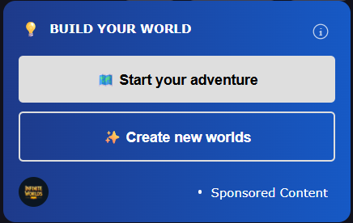
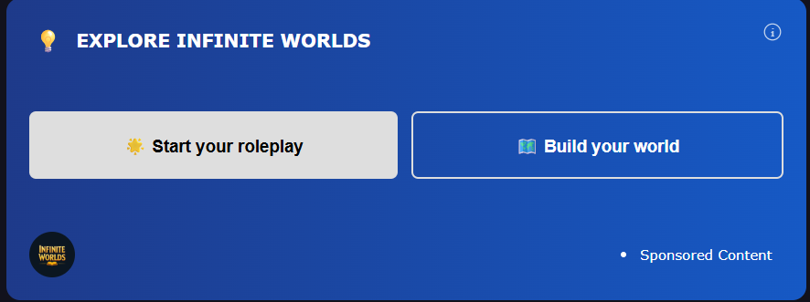
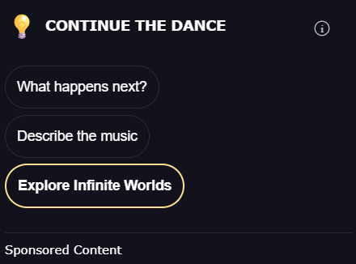
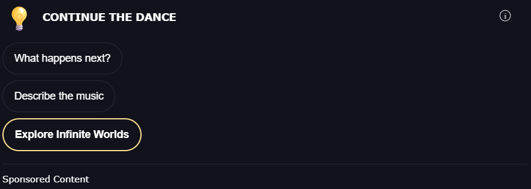
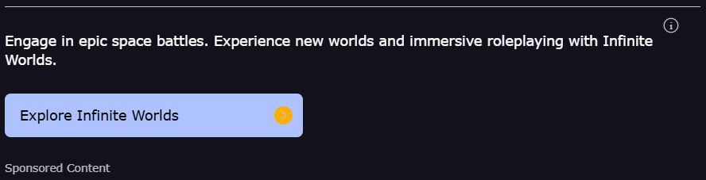
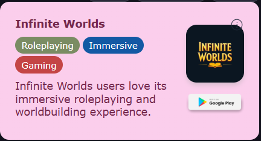
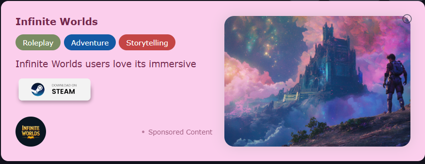
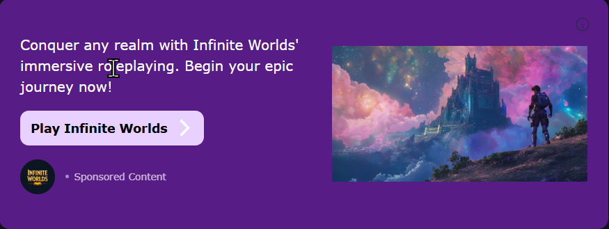

# Simula Ad SDK

**React SDK for AI-Powered Contextual Ads**

Simula delivers **contextually relevant ads** for conversational AI apps and LLM-based interfaces. It’s lightweight, easy to integrate, and MRC-compliant out of the box.

---

## 🚀 Installation

```bash
npm install @simula/ads
```

---

## ⚡ Quick Start

Integrate in **two steps**:

1. **Wrap your app** with `SimulaProvider`
2. **Insert** `<AdSlot />` where you want ads

```tsx
import { SimulaProvider, AdSlot } from "@simula/ads";

function App() {
  return (
    <SimulaProvider apiKey="SIMULA_xxx">
      <YourChatApp />
    </SimulaProvider>
  );
}

function ChatMessage({ messages }) {
  return (
    <div>
      {/* Chat UI */}
      <AdSlot
        messages={messages}
        format="all"
        theme={{ theme: "light", accent: "blue" }}
      />
    </div>
  );
}
```

---

## 🧩 Components

### `SimulaProvider`

Initializes the SDK and manages session state.

| Prop            | Type        | Required | Default | Description                                                                                                      |
| --------------- | ----------- | -------- | ------- | ---------------------------------------------------------------------------------------------------------------- |
| `apiKey`        | `string`    | ✅        | —       | Your Simula API key from the [dashboard](https://simula.ad)                                                      |
| `children`      | `ReactNode` | ✅        | —       | Your app components                                                                                              |
| `devMode`       | `boolean`   | ❌        | `false` | Enables development mode                                                                                         |
| `primaryUserID` | `string`    | ❌        | —       | Publisher-provided user identifier. **Recommended** for consistent tracking across devices and sessions.         |

```tsx
// Wrap your entire app
<SimulaProvider apiKey="SIMULA_xxx">
  <App />
</SimulaProvider>

// Or wrap logged-in content (recommended for authenticated apps)
function App() {
  const { user } = useAuth();

  if (!user) return <LoginPage />;

  return (
    <SimulaProvider apiKey="SIMULA_xxx" primaryUserID={user.id}>
      <AuthenticatedApp />
    </SimulaProvider>
  );
}
```

> **Provider Best Practices**
>
> `SimulaProvider` **doesn't need to wrap your entire app**. But for best results:
>
> * **Wrap logged-in content** – Place it around authenticated sections where we can track a user across a single session
>
> **Provide `primaryUserID`** – Use your user's ID to enable cross-device tracking and cookie-independent identification. This approach delivers:
>
> * **Higher CPMs** – Better user attribution leads to more valuable ad placements
> * **Frequency capping** – Prevents oversending ads to the same user
> * **Better ad experience** – Optimized targeting based on consistent user history
> * **Accurate analytics** – Reliable performance metrics across devices and sessions
>
> For anonymous users, you can still use `SimulaProvider` without `primaryUserID`, but tracking will rely on cookies.

---

### `AdSlot`

Displays an ad based on conversation context.

| Prop           | Type                   | Required | Default                                                                                              | Description                                                                                                                                                                     |
| -------------- | ---------------------- | -------- | ---------------------------------------------------------------------------------------------------- | ------------------------------------------------------------------------------------------------------------------------------------------------------------------------------- |
| `messages`     | `Message[]`            | ✅        | —                                                                                                    | Array of `{ role, content }`; pass recent conversation (e.g. last 6 turns).                                                                                                     |
| `trigger`      | `Promise<any>`         | ❌        | Fires immediately on viewability                                                                     | Promise to await before fetching the ad (e.g. LLM call).                                                                                                                        |
| `formats`      | `string \| string[]`   | ❌        | `['all']`                                                                                            | Preferred ad formats: `'all'`, `'tips'`, `'interactive'`, `'suggestions'`, `'text'`, `'highlight'`, `'visual_banner'`, `'image_feature'`, or an array like `['text', 'highlight']`. See [Appendix: Ad Formats](#appendix-ad-formats) for visual examples.<br>**A/B Testing:** Pass an array to automatically A/B test different formats and let Simula pick the best over time. |
| `theme`        | `SimulaTheme`          | ❌        | `{ theme: 'auto', width: 'auto', accent: ['neutral','image'], font: 'sans-serif', cornerRadius: 8 }` | Customize ad appearance (see Theme Options). Arrays trigger A/B testing.                                                                                                        |
| `char_desc`    | `string`               | ❌        | `undefined`                                                                                          | Character description for additional context to improve ad targeting.                                                                                                           |
| `debounceMs`   | `number`               | ❌        | `0`                                                                                                  | Delay in milliseconds before fetching.                                                                                                                                          |
| `onImpression` | `(ad: AdData) => void` | ❌        | `undefined`                                                                                          | Callback when ad is viewable (50% visible for ≥1s).                                                                                                                             |
| `onClick`      | `(ad: AdData) => void` | ❌        | `undefined`                                                                                          | Callback when ad is clicked.                                                                                                                                                    |
| `onError`      | `(err: Error) => void` | ❌        | `undefined`                                                                                          | Callback when ad fails or no-fill occurs.                                                                                                                                       |

**Behavior:**

* Fetches **once** per slot (static)
* Triggers on **viewport visibility** (50% visible)
* Includes built-in **bot protection**
* Tracks impressions **MRC-compliantly**

---

## 🎨 Theme Options

```ts
interface SimulaTheme {
  theme?: "light" | "dark" | "auto";         // default: "auto"
  accent?: AccentOption | AccentOption[];   // default: ["neutral", "image"] (A/B tested)
  font?: FontOption | FontOption[];         // default: "sans-serif"
  width?: number | string;                  // default: "auto" (min 320px)
  cornerRadius?: number;                    // default: 8
}
```

**Modes:** `light` | `dark` | `auto`
**Accents:**
`blue`, `red`, `green`, `yellow`, `purple`, `pink`, `orange`, `neutral`, `gray`, `tan`, `transparent`, `image`
**Fonts:** `sans-serif`, `serif`, `monospace`

> **Height:** fixed at **265px**
> **Width:** min **320px**, accepts px/%, or `auto`

> **A/B Testing:**
> When you pass an **array** (e.g., `accent: ['blue', 'green', 'purple']`), Simula will **automatically A/B test** across the provided options—colors, fonts, or formats—and **optimize over time for the best-performing variant**.

```tsx
// Default theme (auto)
<AdSlot messages={messages} />

// Light theme
<AdSlot messages={messages} theme={{ theme: "light", accent: "blue" }} />

// Dark theme with custom width
<AdSlot
  messages={messages}
  theme={{ theme: "dark", accent: "purple", width: 600, cornerRadius: 12 }}
/>

// A/B testing
<AdSlot
  messages={messages}
  theme={{
    accent: ["blue", "green", "purple"],     // A/B test colors
    font: ["sans-serif", "serif"],           // A/B test fonts
    width: "100%"
  }}
/>
```

---

## 💬 Integration Example

### Chat App with OpenAI

```tsx
import { useState } from "react";
import { SimulaProvider, AdSlot } from "@simula/ads";
import OpenAI from "openai";

const client = new OpenAI({ apiKey: process.env.OPENAI_API_KEY });

export default function App() {
  return (
    <SimulaProvider apiKey="SIMULA_xxx">
      <ChatApp />
    </SimulaProvider>
  );
}

function ChatApp() {
  const [messages, setMessages] = useState([]);
  const [input, setInput] = useState("");
  const [loading, setLoading] = useState(false);

  async function sendMessage() {
    if (!input.trim()) return;

    const userMessage = { role: "user", content: input.trim() };
    const newMessages = [...messages, userMessage];
    setMessages(newMessages);
    setInput("");
    setLoading(true);

    try {
      const llmPromise = client.chat.completions.create({
        model: "gpt-4o-mini",
        messages: newMessages,
      });

      const res = await llmPromise;
      const reply = res.choices[0].message;

      setMessages((prev) => [...prev, { ...reply, llmPromise }]);
    } finally {
      setLoading(false);
    }
  }

  return (
    <div className="chat">
      {messages.map((msg, i) => (
        <div key={i}>
          <p><strong>{msg.role}:</strong> {msg.content}</p>

          {msg.role === "assistant" && (
            <AdSlot
              key={`adslot-${i}`}              // ✅ Required if rendering in a list
              trigger={msg.llmPromise}         // default: fires immediately if not provided
              messages={messages.slice(0, i + 1)}
              theme={{ theme: "light", accent: "blue", width: "auto" }}
            />
          )}
        </div>
      ))}

      <input
        value={input}
        onChange={(e) => setInput(e.target.value)}
        onKeyDown={(e) => e.key === "Enter" && sendMessage()}
      />
      <button onClick={sendMessage} disabled={loading}>Send</button>
    </div>
  );
}
```

> **Tip:**
>
> * Use `key` only when `<AdSlot />` is rendered inside a list or dynamic loop.
> * If omitted, the ad fetches immediately when viewable.

---

## 🔑 Features

* **Contextual Targeting** – AI-powered ad matching to conversation content
* **Bot Protection** – via [@fingerprintjs/botd](https://github.com/fingerprintjs/botd)
* **MRC-Compliant Viewability** – 50% visible for ≥1s
* **Responsive** – Flexible widths with enforced minimums
* **Static Fetch** – Each slot fetches once and stays fixed
* **Session Management** – Automatic
* **Robust Error Handling** – Graceful degradation & callbacks
* **TypeScript Support** – Built-in type definitions
* **Built-in A/B Testing** – Test multiple colors, formats, or fonts by passing arrays and let Simula optimize performance over time

---

## ⚙️ Advanced Usage

### Event Handlers

```tsx
<AdSlot
  messages={messages}
  onImpression={(ad) => console.log("Impression:", ad.id)}  // default: none
  onClick={(ad) => console.log("Clicked:", ad.id)}          // default: none
  onError={(err) => console.error("Ad error:", err)}        // default: none
/>
```

### Debounce Fetching

```tsx
<AdSlot
  messages={messages}
  debounceMs={500}   // default: 0
/>
```

---

## 📦 TypeScript Types

```ts
import type {
  SimulaTheme,
  Message,
  AdData,
  AdSlotProps,
  SimulaProviderProps
} from "@simula/ads";
```

---

## 📚 Resources

* [Full Docs](https://simula.ad)
* [GitHub Issues](https://github.com/Simula-AI-SDK/simula-ad-sdk/issues)
* Support: **[admin@simula.ad](mailto:admin@simula.ad)**

---

## 📄 License

MIT

---

## 📑 Appendix: Ad Formats

Visual examples of all available ad formats across mobile and desktop:

| Format | Mobile | Desktop |
|--------|--------|---------|
| **tips** |  |  |
| **interactive** |  |  |
| **suggestions** |  |  |
| **text** |  |  |
| **highlight** |  |  |
| **visual_banner** |  |  |
| **image_feature** |  |  |

> **Note:** The `'all'` format allows Simula to automatically select the best format based on context and performance.
