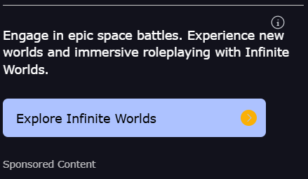

# Simula Ad SDK

**React SDK for AI-Powered Contextual Ads**

Simula delivers **contextually relevant ads** for conversational AI apps and LLM-based interfaces. It’s lightweight, easy to integrate, and MRC-compliant out of the box.

---

## 🚀 Installation

```bash
npm install @simula/ads
```

---

## ⚡ Quick Start

Integrate in **two steps**:

1. **Wrap your chat/conversation component** with `SimulaProvider`
2. **Insert** `<InChatAdSlot />` where you want ads

```tsx
import { SimulaProvider, InChatAdSlot } from "@simula/ads";

function App() {
  return (
    <div>
      <Header />
      <ChatInterface />  {/* SimulaProvider wraps individual conversations */}
    </div>
  );
}

function ChatInterface() {
  const [messages, setMessages] = useState([]);

  return (
    <SimulaProvider apiKey="SIMULA_xxx">
      <div>
        {messages.map((msg, i) => (
          <div key={i}>
            <p><strong>{msg.role}:</strong> {msg.content}</p>
            {msg.role === "assistant" && (
              <InChatAdSlot
                messages={messages.slice(0, i + 1)}
                theme={{ mode: "light", accent: "blue" }}
              />
            )}
          </div>
        ))}
      </div>
    </SimulaProvider>
  );
}
```

---

## 🧩 Components

### `SimulaProvider`

Initializes the SDK and manages session state.

| Prop            | Type        | Required | Default | Description                                                                                                      |
| --------------- | ----------- | -------- | ------- | ---------------------------------------------------------------------------------------------------------------- |
| `apiKey`        | `string`    | ✅        | —       | Your Simula API key from the [dashboard](https://simula.ad)                                                      |
| `children`      | `ReactNode` | ✅        | —       | Your app components                                                                                              |
| `devMode`       | `boolean`   | ❌        | `false` | Enables development mode                                                                                         |
| `primaryUserID` | `string`    | ❌        | —       | Publisher-provided user identifier. **Recommended** for consistent tracking across devices and sessions.         |

```tsx
// Wrap individual chat/conversation components
function ChatInterface({ conversationId }) {
  const [messages, setMessages] = useState([]);

  return (
    <SimulaProvider apiKey="SIMULA_xxx">
      {/* Your chat UI */}
    </SimulaProvider>
  );
}

// For authenticated apps with user tracking (recommended)
function ChatInterface({ conversationId, userId }) {
  const [messages, setMessages] = useState([]);

  return (
    <SimulaProvider apiKey="SIMULA_xxx" primaryUserID={userId}>
      {/* Your chat UI */}
    </SimulaProvider>
  );
}
```

> **Provider Best Practices**
>
> * **Wrap individual conversations** – Place `SimulaProvider` around each chat or character component so that each conversation is treated as a separate session. This provides better ad targeting based on conversation context.
>
> * **Provide `primaryUserID`** – Use your user's ID to enable cross-device tracking and cookie-independent identification. This approach delivers:
>   * **Higher CPMs** – Better user attribution leads to more valuable ad placements
>   * **Frequency capping** – Prevents oversending ads to the same user
>   * **Better ad experience** – Optimized targeting based on consistent user history
>   * **Accurate analytics** – Reliable performance metrics across devices and sessions
>
> * **One provider per conversation** – Don't nest multiple `SimulaProvider` instances. Each conversation/chat component should have its own provider at the top level.
>
> For anonymous users, you can still use `SimulaProvider` without `primaryUserID`, but tracking will rely on cookies.

---

### `InChatAdSlot`

Displays an ad based on conversation context.

| Prop           | Type                   | Required | Default                                                                                              | Description                                                                                                                                                                     |
| -------------- | ---------------------- | -------- | ---------------------------------------------------------------------------------------------------- | ------------------------------------------------------------------------------------------------------------------------------------------------------------------------------- |
| `messages`     | `Message[]`            | ✅        | —                                                                                                    | Array of `{ role, content }`; pass recent conversation (e.g. last 6 turns).                                                                                                     |
| `trigger`      | `Promise<any>`         | ❌        | Fires immediately on viewability                                                                     | Promise to await before fetching the ad (e.g. LLM call).                                                                                                                        |
| `theme`        | `SimulaTheme`          | ❌        | `{ mode: 'auto', width: 'auto', accent: ['neutral','image'], font: 'sans-serif', cornerRadius: 8 }` | Customize ad appearance (see Theme Options). Arrays trigger A/B testing.                                                                                                        |
| `charDesc`     | `string`               | ❌        | `undefined`                                                                                          | Character description for additional context to improve ad targeting.                                                                                                           |
| `debounceMs`   | `number`               | ❌        | `0`                                                                                                  | Delay in milliseconds before fetching.                                                                                                                                          |
| `onImpression` | `(ad: AdData) => void` | ❌        | `undefined`                                                                                          | Callback when ad is viewable (50% visible for ≥1s).                                                                                                                             |
| `onClick`      | `(ad: AdData) => void` | ❌        | `undefined`                                                                                          | Callback when ad is clicked.                                                                                                                                                    |
| `onError`      | `(err: Error) => void` | ❌        | `undefined`                                                                                          | Callback when ad fails or no-fill occurs.                                                                                                                                       |

**Behavior:**

* Fetches **once** per slot (static)
* Triggers on **viewport visibility** (50% visible)
* Includes built-in **bot protection**
* Tracks impressions **MRC-compliantly**

---

## 🎨 Theme Options

```ts
interface SimulaTheme {
  mode?: "light" | "dark" | "auto";         // default: "auto"
  accent?: AccentOption | AccentOption[];   // default: ["neutral", "image"] (A/B tested)
  font?: FontOption | FontOption[];         // default: "sans-serif"
  width?: number | string;                  // default: "auto" (min 320px)
  cornerRadius?: number;                    // default: 8
}
```

**Modes:** `light` | `dark` | `auto`
**Accents:**
`blue`, `red`, `green`, `yellow`, `purple`, `pink`, `orange`, `neutral`, `gray`, `tan`, `transparent`, `image`
**Fonts:** `sans-serif`, `serif`, `monospace`

> **Height:** fixed at **265px**
> **Width:** min **320px**, accepts px/%, or `auto`

> **A/B Testing:**
> When you pass an **array** (e.g., `accent: ['blue', 'green', 'purple']`), Simula will **automatically A/B test** across the provided options—colors or fonts—and **optimize over time for the best-performing variant**.
>
> **💡 We strongly encourage adding the `"image"` option for accent** (e.g., `accent: ['blue', 'image']`)

```tsx
// Default mode (auto)
<InChatAdSlot messages={messages} />

// Light mode
<InChatAdSlot messages={messages} theme={{ mode: "light", accent: "blue" }} />

// Dark mode with custom width
<InChatAdSlot
  messages={messages}
  theme={{ mode: "dark", accent: "purple", width: 600, cornerRadius: 12 }}
/>

// A/B testing (recommended: include "image" for best performance)
<InChatAdSlot
  messages={messages}
  theme={{
    accent: ["blue", "green", "image"],      // A/B test colors - include "image" for best CPM
    font: ["sans-serif", "serif"],           // A/B test fonts
    width: "100%"
  }}
/>
```

---

## 💬 Integration Example

### Chat App with OpenAI

```tsx
import { useState } from "react";
import { SimulaProvider, InChatAdSlot } from "@simula/ads";
import OpenAI from "openai";

const client = new OpenAI({ apiKey: process.env.OPENAI_API_KEY });

export default function App() {
  return (
    <div>
      <Header />
      <ChatApp />  {/* Each conversation has its own SimulaProvider */}
    </div>
  );
}

function ChatApp() {
  const [messages, setMessages] = useState([]);
  const [input, setInput] = useState("");
  const [loading, setLoading] = useState(false);

  async function sendMessage() {
    if (!input.trim()) return;

    const userMessage = { role: "user", content: input.trim() };
    const newMessages = [...messages, userMessage];
    setMessages(newMessages);
    setInput("");
    setLoading(true);

    try {
      const llmPromise = client.chat.completions.create({
        model: "gpt-4o-mini",
        messages: newMessages,
      });

      const res = await llmPromise;
      const reply = res.choices[0].message;

      setMessages((prev) => [...prev, { ...reply, llmPromise }]);
    } finally {
      setLoading(false);
    }
  }

  return (
    <SimulaProvider apiKey="SIMULA_xxx">
      <div className="chat">
        {messages.map((msg, i) => (
          <div key={i}>
            <p><strong>{msg.role}:</strong> {msg.content}</p>

            {msg.role === "assistant" && (
              <InChatAdSlot
                key={`adslot-${i}`}              // ✅ Required if rendering in a list
                trigger={msg.llmPromise}         // default: fires immediately if not provided
                messages={messages.slice(0, i + 1)}
                theme={{ mode: "light", accent: "blue", width: "auto" }}
              />
            )}
          </div>
        ))}

        <input
          value={input}
          onChange={(e) => setInput(e.target.value)}
          onKeyDown={(e) => e.key === "Enter" && sendMessage()}
        />
        <button onClick={sendMessage} disabled={loading}>Send</button>
      </div>
    </SimulaProvider>
  );
}
```

> **Tips:**
>
> * **Wrap `SimulaProvider` around the chat component** – This treats each conversation as a separate session for better ad targeting.
> * Use `key` prop when `<InChatAdSlot />` is rendered inside a list or dynamic loop.
> * The `trigger` prop waits for the LLM response before fetching ads. If omitted, the ad fetches immediately when viewable.

---

## 🔑 Features

* **Contextual Targeting** – AI-powered ad matching to conversation content
* **Bot Protection** – via [@fingerprintjs/botd](https://github.com/fingerprintjs/botd)
* **MRC-Compliant Viewability** – 50% visible for ≥1s
* **Responsive** – Flexible widths with enforced minimums
* **Static Fetch** – Each slot fetches once and stays fixed
* **Session Management** – Automatic
* **Robust Error Handling** – Graceful degradation & callbacks
* **TypeScript Support** – Built-in type definitions
* **Built-in A/B Testing** – Test multiple colors or fonts by passing arrays and let Simula optimize performance over time

---

## ⚙️ Advanced Usage

### Event Handlers

```tsx
<InChatAdSlot
  messages={messages}
  onImpression={(ad) => console.log("Impression:", ad.id)}  // default: none
  onClick={(ad) => console.log("Clicked:", ad.id)}          // default: none
  onError={(err) => console.error("Ad error:", err)}        // default: none
/>
```

### Debounce Fetching

```tsx
<InChatAdSlot
  messages={messages}
  debounceMs={500}   // default: 0
/>
```

---

## 📦 TypeScript Types

```ts
import type {
  SimulaTheme,
  Message,
  AdData,
  InChatAdSlotProps,
  SimulaProviderProps
} from "@simula/ads";
```

---

## 📚 Resources

* [Website](https://simula.ad)
* [GitHub Issues](https://github.com/Simula-AI-SDK/simula-ad-sdk/issues)
* Support: **[admin@simula.ad](mailto:admin@simula.ad)**

---

## 📄 License

MIT

---

## 📑 Appendix: Ad Formats

Format examples are shown below, as well as more custom formats. If you want any formats excluded, reach out to us and we can exclude it programmatically in the backend. But we strongly encourage allowing all formats so we can A/B test the one your users are most receptive towards to maximize CPM.

Visual examples of all available ad formats across mobile and desktop:

| Format | Mobile | Desktop |
|--------|--------|---------|
| **tips** |  |  |
| **interactive** |  |  |
| **suggestions** |  |  |
| **text** |  |  |
| **highlight** |  |  |
| **visual_banner** |  |  |
| 
